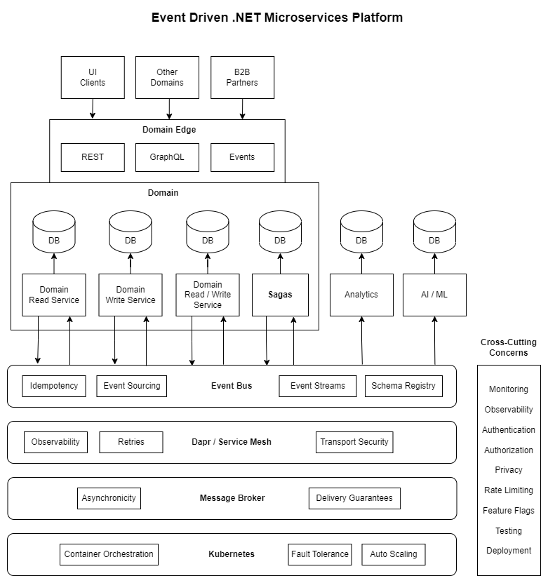
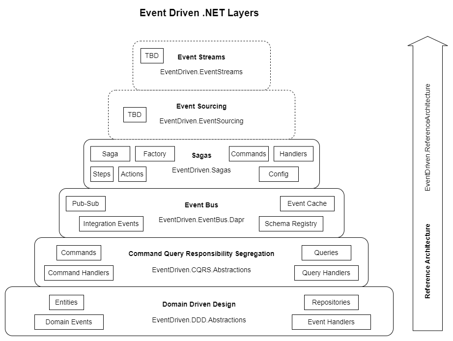

# Event Driven .NET

An event-driven microservices platform for .NET

## Introduction

[Microservices](https://en.wikipedia.org/wiki/Microservices) is a popular paradigm for building highly scalable and flexible distributed systems based on Cloud computing. While the *what* of microservices is fairly unambiguous, the *how* is replete with pitfalls and perils. Many teams embark on the road of good intentions only to find themselves mired in a quicksand of tightly coupled systems -- the [distributed monolith](https://www.simplethread.com/youre-not-actually-building-microservices/) -- with few of the benefits but most of the difficulties of a traditional monolith. Much of this stems from using synchronous REST calls as the primary means of inter-service communication, which can result in systems that are brittle and inflexible, teams that block one another, and services that must be deployed and scaled as a single unit.

The purpose of [Event Driven .NET](https://github.com/event-driven-dotnet) is to provide a platform where .NET developers can build loosely coupled distributed systems consisting of services that can be deployed and scaled independently, replacing point-to-point communication with an [event bus abstraction](https://github.com/event-driven-dotnet/EventDriven.EventBus.Abstractions) that promotes asynchronous communication using a message broker.

  

UI Clients, other domains and B2B partners interact synchronously and asynchronously with the **Domain Edge** by means of [REST](https://en.wikipedia.org/wiki/Representational_state_transfer), [GraphQL](https://graphql.org/) or events. Within a **Domain**, read and write services interact with one another using an **Event Bus**, and they perform updates to data stores which are private to each service. The Event Bus supports *idempotency* with an event cache that allows filtering of duplicate messages, and it uses a *schema registry* to ensure that events for the same topic are compatible with registered schemas. [Sagas](https://microservices.io/patterns/data/saga.html) use the Event Bus to orchestrate updates across services so that they all succeed or are rolled back by means of compensating actions. [Data analytics](https://en.wikipedia.org/wiki/Data_analysis) and [AI](https://en.wikipedia.org/wiki/Artificial_intelligence) / [ML](https://en.wikipedia.org/wiki/Machine_learning) ingest events to update their respective data stores.

The event bus provides a [pub-sub](https://en.wikipedia.org/wiki/Publish%E2%80%93subscribe_pattern) abstraction for asynchronous inter-service communication.  [Dapr](https://dapr.io/) provides application-level building blocks for state management, pub/sub messaging, actors, etc. The message broker transports messages between publishers and subscribers. Examples of supported message brokers are [Amazon SNS+SQS](https://aws.amazon.com/blogs/aws/queues-and-notifications-now-best-friends/), [Azure Service Bus](https://docs.microsoft.com/en-us/azure/service-bus-messaging/service-bus-messaging-overview) or [Apache Kafka](https://kafka.apache.org/).

While Dapr provides some capabilities of a service mesh, such as inter-service encryption, monitoring, observability and delivery retries, it operates at the application level, whereas a [service mesh](https://en.wikipedia.org/wiki/Service_mesh) operates at the networking level and provides features such as routing and traffic splitting. Dapr can be used in combination with a service mesh.

[Kubernetes](https://kubernetes.io/) is an open-source system for automating deployment, scaling and management of containerized applications by grouping containers into units that can be discovered and managed. It hosts plugins for storage, networking and scheduling, and it serves as a foundation for container-based microservices.

Along side the microservices infrastructure stack are a number of *cross-cutting concerns*, such as monitoring and observability, security and privacy, feature flags, testing and deployment.

## Strategy

The mission of **Event Driven .NET** is to furnish a *multi-layered platform* upon which .NET developers can build distributed applications that deliver on the promise of microservices by enabling multiple teams working in parallel to deliver features to customers with greater speed and reliability.

Rather than building a high prescriptive framework that locks developers into one way of building microservices, Event Driven .NET includes a set of *abstractions* that can be implemented in any number of ways. For convenience some default implementations are supplied so that developers can get started right away building event-driven microservices. But rather than attempting to do everything for the developer, Event Driven .NET instead provides a set of reference architectures which teams can use as examples for building distributed systems which reflect their organization's business needs and operational maturity.

### Layered Approach

**Event Driven .NET** is designed to allow you to wade gradually into the waters of event-driven microservices, so that your system architecture aligns with your organizational structure, as well as the skill set of your developers and the maturity of your DevOps processes.

  

Starting at the bottom, you adopt a [Domain Driven Design](https://en.wikipedia.org/wiki/Domain-driven_design) (DDD) approach, then build on this foundation by adding [Command Query Responsibility Segregation](https://martinfowler.com/bliki/CQRS.html) (CQRS). When you have the need for inter-service communication, you can move to the [Event Bus](https://martinfowler.com/eaaDev/EventCollaboration.html) layer, utilizing [Dapr](https://dapr.io/) as a [pub-sub](https://en.wikipedia.org/wiki/Publish%E2%80%93subscribe_pattern) abstraction over an underlying message broker.

If you have the need to maintain eventual data consistency with updates to multiple services spanning a logically atomic operation, you are ready to advance to the next layer: [Sagas](https://microservices.io/patterns/data/saga.html). When your organization has the need for capabilities such as built-in audit trail and the ability to atomically persist and publish events, you may wish to move to the [Event Sourcing](https://microservices.io/patterns/data/event-sourcing.html) layer (to be implemented).

Lastly, if you wish to perform real-time data analysis and transformation, you may wish to explore [Event Streams](https://hazelcast.com/glossary/event-stream-processing/) (to be implemented).

### Abstractions

Each layer is supported by a set of **abstraction** distributed as [NuGet](https://www.nuget.org/) packages.

> **Note**: [EventDriven.CQRS.Abstractions](https://github.com/event-driven-dotnet/EventDriven.CQRS.Abstractions) version 2.0 or later uses [MediatR](https://github.com/jbogard/MediatR) to enable a handler per command pattern with behaviors for cross-cutting concerns.

- **Domain Driven Design**
  - [EventDriven.DDD.Abstractions](https://www.nuget.org/packages/EventDriven.DDD.Abstractions): Abstractions for implementing Domain Driven Design.
- **Command Query Responsibility Segregation**
  - [EventDriven.CQRS.Abstractions](https://www.nuget.org/packages/EventDriven.DependencyInjection/): Abstractions for implementing Command Query Responsibility Segregation.
- **Dependency Injection**
  - [EventDriven.DependencyInjection](https://www.nuget.org/packages/EventDriven.DependencyInjection.URF.Mongo/): Helper methods for configuring services with dependency injection.
- **Event Bus**
  - [EventDriven.EventBus.Abstractions](https://www.nuget.org/packages/EventDriven.EventBus.Abstractions): Generic event bus abstraction. 
  - [EventDriven.SchemaRegistry.Abstractions](https://www.nuget.org/packages/EventDriven.SchemaRegistry.Abstractions): Generic schema registry abstraction. 
- **Sagas**
  - [EventDriven.Sagas.Abstractions](https://www.nuget.org/packages/EventDriven.Sagas.Abstractions): Abstractions for sagas, steps, actions, commands, dispatchers, handlers and evaluators.
  - [EventDriven.Sagas.Configuration.Abstractions](https://www.nuget.org/packages/EventDriven.Sagas.Configuration.Abstractions): Abstractions for saga configurations.
  - [EventDriven.Sagas.EventBus.Abstractions](https://www.nuget.org/packages/EventDriven.Sagas.EventBus.Abstractions): Abstractions for handling integration events and dispatching command results.
  - [EventDriven.Sagas.Persistence.Abstractions](https://www.nuget.org/packages/EventDriven.Sagas.Persistence.Abstractions): Abstractions for persisting saga snapshots.

### Libraries

Each layer is supported by a set of **abstraction** distributed as [NuGet](https://www.nuget.org/) packages. Simply reference the appropriate package in your project to utilize its interfaces and classes.

- **Command Query Responsibility Segregation**
  - [EventDriven.CQRS.Extensions](https://www.nuget.org/packages/EventDriven.CQRS.Extensions/): Extensions for implementing Command Query Responsibility Segregation.
- **Dependency Injection**
  - [EventDriven.DependencyInjection.Mongo](https://www.nuget.org/packages/EventDriven.DependencyInjection.URF.Mongo/): Helper methods for configuring services for MongoDB with dependency injection.
- **Event Bus**
  - [EventDriven.EventBus.Dapr](https://www.nuget.org/packages/EventDriven.EventBus.Dapr): Event bus abstraction over Dapr pub/sub.
  - [EventDriven.EventBus.Dapr.EventCache.Mongo](https://www.nuget.org/packages/EventDriven.EventBus.Dapr.EventCache.Mongo): MongoDB implementation of event caching with Dapr state store.
  - [EventDriven.SchemaValidator.Json](https://www.nuget.org/packages/EventDriven.SchemaValidator.Json/): JSON implementation of a schema validator.
  - [EventDriven.SchemaRegistry.Mongo](https://www.nuget.org/packages/EventDriven.SchemaRegistry.Mongo): MongoDB state store for validating messages against schemas that are stored in a registry by topic name.
- **Sagas**
  - [EventDriven.Sagas.Configuration.Mongo](https://www.nuget.org/packages/EventDriven.Sagas.Configuration.Mongo): MongoDB implementation for saga configuration repositories.
  - [EventDriven.Sagas.DependencyInjection](https://www.nuget.org/packages/EventDriven.Sagas.DependencyInjection): `AddSaga` service collection extension methods.
  - [EventDriven.Sagas.Persistence.Mongo](https://www.nuget.org/packages/EventDriven.Sagas.Persistence.Mongo): MongoDB implementation for persisting saga snapshots.

### Reference Architectures

To aid you in implementing an event-driven microservices architecture, **Event Driven .NET** includes **reference architectures**, which utilize the abstractions listed above to provide a working example of how to structure a microservices solution based on event-driven architecture.

- [EventDriven.ReferenceArchitecture](https://github.com/event-driven-dotnet/EventDriven.ReferenceArchitecture): Reference architecture for using EventDriven abstractions and libraries for **Domain Driven Design** (DDD), **Command-Query Responsibility Segregation** (CQRS) and **Event Driven Architecture** (EDA) with Dapr Event Bus.

  

- [EventDriven.Sagas](https://github.com/event-driven-dotnet/EventDriven.Sagas): Abstractions and reference architecture for implementing the **Saga pattern** to orchestrate atomic operations which span multiple services.

## Getting Started

To get started with **Event Driven .NET**, take the following steps to create a .NET Web API project that applies the principles of Domain Driven Design, Command Query Responsibility Segregation and Event Driven Architecture.

1. Using a process such as [Event Storming](https://en.wikipedia.org/wiki/Event_storming), define a business [domain model](https://docs.microsoft.com/en-us/dotnet/architecture/microservices/microservice-ddd-cqrs-patterns/microservice-domain-model) with separate [bounded contexts](https://martinfowler.com/bliki/BoundedContext.html) and [aggregate roots](https://www.alibabacloud.com/blog/an-in-depth-understanding-of-aggregation-in-domain-driven-design_598034).
   - While it may be possible to [scope microservices](https://programhappy.net/2020/10/18/implementing-domain-driven-design-with-microservices/) at the level of a bounded context, it is often preferable to create *one microservice per aggregate root*.
2. Create a [.NET Web API project](https://docs.microsoft.com/en-us/aspnet/core/tutorials/first-web-api) with the following packages:
   - MongoDB.Driver
   - URF.Core.Mongo
   - AutoMapper.Extensions.Microsoft.DependencyInjection
   - EventDriven.DependencyInjection.URF.Mongo
   - EventDriven.CQRS.Abstractions
   - EventDriven.EventBus.Dapr
   - EventDriven.EventBus.Dapr.EventCache.Mongo
3. Using Event Driven [Reference Architecture](https://github.com/event-driven-dotnet/EventDriven.ReferenceArchitecture) as a guide, follow the [Development Guide](https://github.com/event-driven-dotnet/EventDriven.ReferenceArchitecture/blob/master/DevelopmentGuide.md) to add domain **entities**, **commands** and **events**.
   - Use **CustomerService** in the reference architecture as an example.
4. Implement `ICommandProcessor` and `IEventApplier` interfaces on the aggregate root entity to add `Process` and `Apply` methods.
   - The `Process` method returns one or more domain events.
   - The `Apply` method accepts a domain event and contains business logic for updating the entity state. 
   - This pattern enables the addition of [Event Sourcing](https://microservices.io/patterns/data/event-sourcing.html) at a later stage while minimizing the need for refactoring entities.
5. Define **repository** interfaces and implementations to handle persistence concerns.
   - The reference architecture utilizes [MongoDB](https://www.mongodb.com/) for persistence, but if you prefer feel free to use a SQL database and ORM, such as [Postgres](https://www.postgresql.org/) or [SQL Server](https://docs.microsoft.com/en-us/sql/linux/quickstart-install-connect-docker) with [Entity Framework Core](https://docs.microsoft.com/en-us/ef/core/).
6. Add a **command handler** to process commands, apply events and persist entities.
7. Add [Data Transfer Objects](https://docs.microsoft.com/en-us/aspnet/web-api/overview/data/using-web-api-with-entity-framework/part-5) (DTO's) and an [AutoMapper](https://automapper.org/) profile, so that controllers can accept and return DTO's instead of entities. 
8. Add query and command **controllers**.
   - Query controllers can accept a repository interface.
   - Command controllers can accept a command handler.
9. Create an Integration class library project with C# records that extend `IntegrationEvent` and include models.
   - Use the **Common** project as an example.
   - Add the following package: EventDriven.EventBus.Abstractions.
10. Update the command handler to accept an `IEventBus` and publish **integration events** so that subscribing projects may receive notifications of events.
    - Reference the Integration project from the Web API project.
11. Repeat the previous steps to create other services based on different aggregate roots.
    - Use **OrderService** in the reference architecture as an example.
    - Reference the Integration project to use integration events.
    - Add **integration event handlers** with classes that extend `IntegrationEventHandler`.
    - Update `Program` to map integration event handlers to event bus subscribers.

## Roadmap

The roadmap for **Event Driven .NET** includes the following items:

- **Event Sourcing**: This will provide the ability to treat domain events as the *source of truth* for a system, so that services no longer need to treat persistence and event publishing atomically. It also provides built-in audit trail. 
- **Event Streams**: This will support real-time data analysis and transformation by means of a durable, append-only message broker, such as [Apache Kafka](https://kafka.apache.org/) or [Amazon Kinesis](https://aws.amazon.com/kinesis/).

## Contributing

_Contributions from the community are welcome!_

To ask a question, report a defect or propose an enhancement, please [open an issue](https://docs.github.com/en/issues/tracking-your-work-with-issues/quickstart) in the appropriate repository. If you are unsure of which repository is appropriate, or your issue is general in nature, please open an issue in the Event Driven .NET [Home](https://github.com/event-driven-dotnet/Home) repository.

If you wish to contribute a change to any repository, please refer to the [Contributing Guidelines](https://github.com/event-driven-dotnet/.github/blob/5976fb2e7bdce6a169327a9badb5f48b0d50d503/CONTRIBUTING.md). Before [creating a pull request](https://docs.github.com/en/pull-requests/collaborating-with-pull-requests/proposing-changes-to-your-work-with-pull-requests/creating-a-pull-request), please open an issue in the repository where you wish to propose a change.